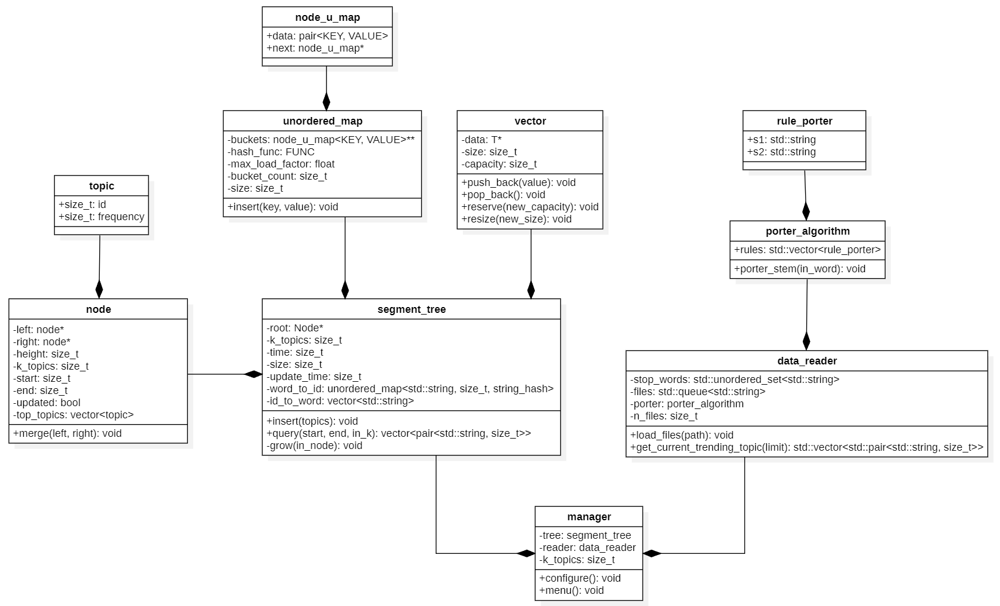

# Segment Tree para los k-trending topics

## Descripción
Se busca implementar un Segment Tree optimizado para almacenar y consultar trending topics.

### Incluye
- Procesamiento de palabras (stopwords, Porter stemming, etc)
- Consulta de rango de tiempos variable
- Consulta de k-tópicos variable
- Graficador en Python

## Arquitectura

### Explicación de clases del código

| Clase | Explicación |
|-------|-------------|
| `Topic` | Tópico representado |
| `unordered_map` | Unordered map para la clase del árbol |
| `node_u_map` | Nodo del unordered_map |
| `vector` | Vector para la clase del árbol |
| `node` | Nodo que va en la clase del árbol |
| `segment_tree` | Segment tree para procesar los tópicos |
| `rule_porter` | Regla del porter stemming |
| `porter_algorithm` | Algoritmo de stemming, usado en el pre-procesado |
| `data_reader` | Clase que se encarga de leer y pre-procesar los archivos |
| `manager` | Integración de data_reader, segment_tree y el graficador en Python |

### Diagrama de clases


### Flujo de los datos
Flujo del árbol al momento de hacer una inserción:

**Árbol antes de insertar:**


**Árbol después de insertar:**


## Menú

### Configuración inicial
El usuario debe ingresar los k tópicos con los cuales el árbol se va a construir mediante consola.

### Menú principal
El menú presenta las siguientes opciones:

1. **Insertar y consultar 1 dato**  
   Esta opción permite al usuario insertar un solo dato en el Segment Tree y realizar una consulta sobre ese dato inmediatamente después de la inserción.

2. **Inserción 10% y cada 1% una query**  
   Esta opción inserta el 10% de los datos y hace una consulta a cada 1% insertado.

3. **Ejecución completa y query instantánea**  
   Este modo realiza la inserción de todos los datos y, después de cada inserción, realiza una consulta instantánea.

4. **Ejecución completa y query al final**  
   Este modo realiza la inserción de todos los datos y, después de haberlos insertado todos, realiza una consulta instantánea.

5. **Ejecutar query**  
   Permite al usuario ejecutar una consulta especificando el rango de tiempo y el número de tópicos.

6. **Salir**  
   Sale del programa.

## Dependencias

### Aclaraciones
GCC esta en la versión **15.2.0** y PYTHON esta en la versión **3.13.1**

### C++
No requiere librerías adicionales aparte de STL, necesita por lo menos **C++17**.

### Python
Para la parte de visualización, se necesitan las siguientes librerías:
- `WordCloud`
- `matplotlib`

Las librerías de Python se pueden instalar usando pip:
```bash
pip install wordcloud matplotlib
```

### Dataset
El dataset utilizado en este proyecto es el proporcionado en clase, contiene archivos en formato `.txt`.

El archivo que contiene el dataset se encuentra en el repositorio bajo el nombre `dataset.zip`.

## Ejecución

### Ruta
Para ejecutar el proyecto, solo se necesita cambiar en el archivo `main.cpp` el valor del string `files_path` por la ubicación de la carpeta donde estarán los archivos a probar.
```cpp
std::string files_path = "D:\\RUTA_CAPETA\\";
```

Una vez proporcionada una ruta válida, el código se ejecutará inmediatamente.

### Configuración de tiempos
En el archivo `main.cpp`, los siguientes parámetros controlan los tiempos de ejecución:
```cpp
std::string time_manual = "-1",
            time_batch = "2",
            time_complete = "-1",
            time_manual_query = "0.75",
            time_query = "-1";
```

- `time_manual`: Tiempo de apertura en modo manual.
- `time_batch`: Tiempo de apertura en modo por lotes.
- `time_complete`: Tiempo de apertura en ejecución completa.
- `time_manual_query`: Tiempo apertura en ejecución completa con queries.
- `time_query`: Tiempo de apertura de una consulta.

Si el valor de estos tiempos está como `-1`, entonces se abrirán por tiempo indefinido.

## Compilación

Para compilarlo se necesita ejecutar el siguiente comando en la carpeta donde se encuentran los archivos del proyecto:
```bash
g++ -std=c++17 -O2 -o proyecto *.cpp
```

Este comando compilará todos los archivos `.cpp` del proyecto y generará un ejecutable llamado `proyecto`.

Se podrá ejecutar el proyecto con el siguiente comando:
```bash
./proyecto.exe
```

## Autor
**Diego Hidalgo**  
Correo: diego.hidalgo@ucsp.edu.pe
